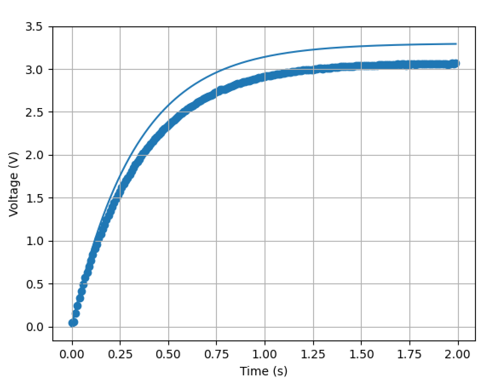

<h1>ME 405 Lab 0</h1>
Scott Frizzell and Jacques Lacroix

This repository runs and plots experimental response of a capacitor circuit to a step input.

Below is a figure shown the expected vs actual result.

